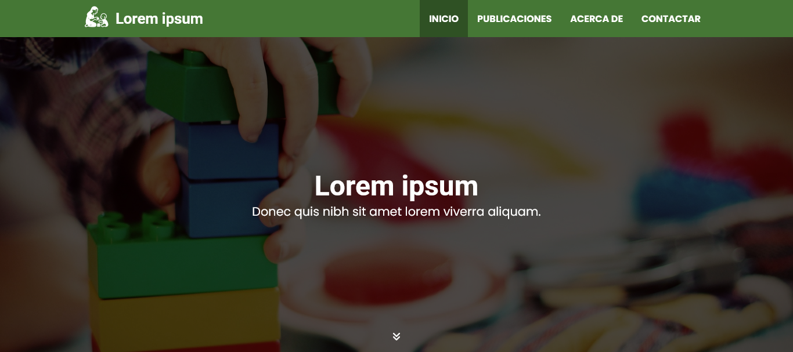

# Fundadores

Tema WordPress diseñado para el sitio web del Hogar Infantil Los Fundadores.



## Instalación

### Tema

El tema como tal se encuentra en `wp-content/themes/fundadores`. Para obtener más detalles, consulta el archivo [README](wp-content/themes/fundadores/README.md) en esa ubicación.

### Docker

Con Docker puedes visualizar el tema en un entorno de desarrollo configurado para un proyecto demostrativo. Sigue estos pasos:

1. Asegúrate de tener instalado [Docker](https://www.docker.com/products/docker-desktop/) y que el servicio esté en ejecución.
2. Descarga o clona este repositorio y accede a la carpeta del proyecto.
3. Renombra el archivo `.env.example` a `.env`.
4. Abre la terminal y ejecuta lo siguiente para instalar las dependencias y levantar los contenedores:

```
docker compose up
```

5. Abre el navegador web y visita la dirección http://localhost:8000 para visualizar el sitio web.
6. Accede a MailHog en http://localhost:8002.

#### Credenciales

Para acceder al _Escritorio_ de WordPress, ve a http://localhost:8000/wp-admin e ingresa las siguientes credenciales:

**Nombre de usuario:** `admin`\
**Contraseña:** `adminpass@li#2025`
