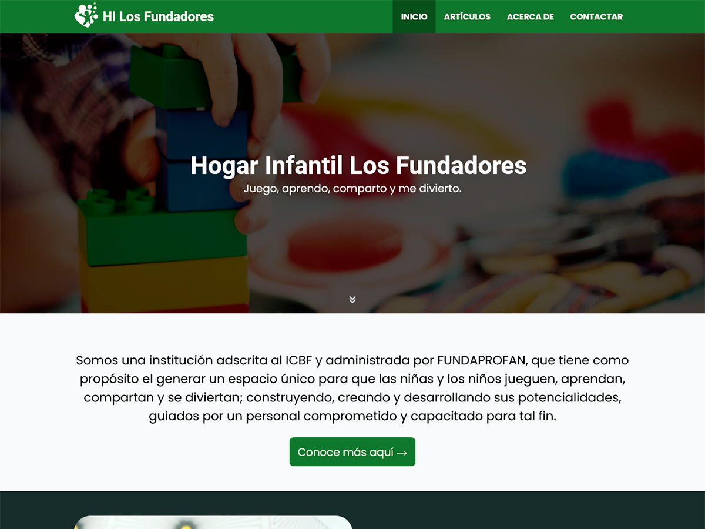

# Fundadores

Tema WordPress diseñado para el sitio del Hogar Infantil Los Fundadores.

## Instalación

1. Asegúrate de tener instalado WordPress con todas sus dependencias.
2. Descarga o clona este repositorio e ingresa a él.
3. Copia la carpeta `fundadores` (ubicado en `wp-content/themes`) y pégalo en la misma ruta de tu proyecto WordPress.
4. Abre el navegador web y accede al _Escritorio_ de tu proyecto WordPress.
5. Ubícate en `Apariencia > Temas`.
6. Presiona el botón _Activar_ del tema _Fundadores_.

## Configuración

### Páginas

El tema requiere de la presencia de cuatro páginas, estas son:

- Página con título «Inicio».
- Página con título «Publicaciones».
- Página con título «Contactar».
- Página con título «Acerca de».

Las páginas se crean en `Páginas > Añadir página`. Una vez creadas las páginas, sigue estos pasos:

1. Ubícate en `Ajustes > Lectura`.
2. En el apartado _Tu portada muestra_, elige _Una página estática_.
3. En el menú _Portada_, elige _Inicio_.
4. En el menú _Página de entradas_, elige _Publicaciones_.
5. Presiona el botón _Guardar cambios_.

### Ajustes

En `Ajustes > Generales` se puede establecer lo siguiente:

- Clave de sitio y clave secreta de reCAPTCHA para los formularios.
- ID de la imagen por defecto de los extractos.
- Dirección de correo electrónico a donde se enviarán los mensajes del formulario de contacto.

### Widgets

En `Apariencia > Widgets` se puede establecer el contenido de la página principal:

- **Cabecera**: se debe agregar un bloque de texto _Encabezado_ (H2) para el título del sitio web y uno de _Párrafo_ para el eslogan de la entidad. La imagen de la portada se agrega en `Apariencia > Personalizar > Imagen de cabecera`.
- **Acerca de**: se debe agregar un bloque de texto _Párrafo_ para una breve descripción de la entidad.
- **Servicios**: se debe agregar un bloque de medios _Medios y texto_ para una breve descripción de los servicios que ofrece la entidad.
- **Artículos recientes**: se debe agregar un bloque de texto _Encabezado_ (H2) para el título de la sección y uno de _Párrafo_ para una breve descripción de la misma. Esta sección mostrará las tres entradas más recientes del sitio web.
- **Ubicación**: se debe agregar dos bloques de diseño _Grupo_, disposición _Contenedor_, con un bloque de texto _Encabezado_ (H2) y uno de _Párrafo_ en el primero, en donde se detalle la ubicación de la entidad; y un _widget_ _HTML personalizado_ en el segundo, en donde se inserte el HTML de un mapa con la ubicación de la entidad.
- **Información de contacto**: se debe agregar un bloque de texto _Encabezado_ (H2) para el título de la sección y uno de _Párrafo_ para una breve descripción de la misma.
- **Pie de página**: se debe agregar dos bloques de diseño _Grupo_, disposición _Contenedor_, con un bloque de texto _Encabezado_ (H2) y uno de _Párrafo_ en el primero, en donde se detalle los datos generales de la entidad; y bloques de medios _Imagen_ en el segundo, en donde se inserten los logotipos de terceros vinculados a la entidad.

### Personalización

En `Apariencia > Personalizar` se puede editar la apariencia del sitio web:

- `Identidad del sitio > Logotipo`: corresponde a la imagen que acompañará al título en la barrá de menús.
- `Identidad del sitio > Título`: corresponde al título de la cabecera de la barrá de menús.
